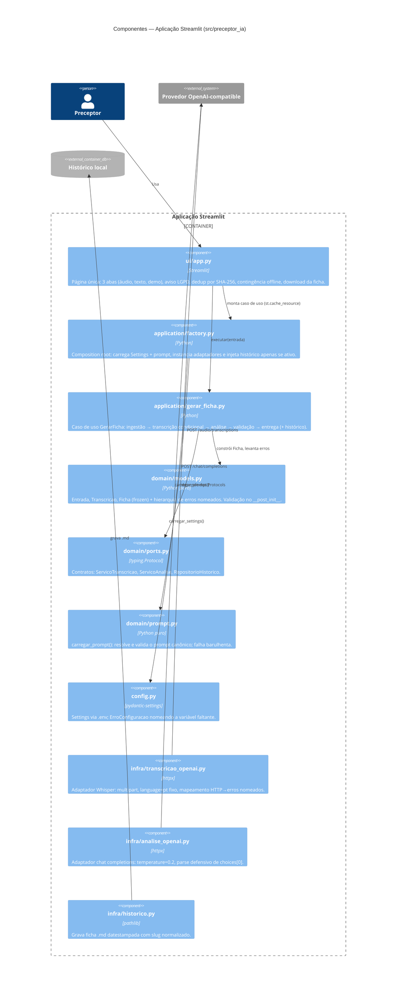

# C4 — Nível 3: Componentes — PreceptorIA

> Gerado pelo **Architect** (Reversa) em 2026-07-20. Container detalhado: **Aplicação Streamlit** (único container de código).
> Escala: 🟢 CONFIRMADO · 🟡 INFERIDO · 🔴 LACUNA

## Diagrama



## Regras de dependência entre camadas

Direção das setas de import 🟢 (confirmada em [code-analysis.md](code-analysis.md) e [dependencies.md](dependencies.md)):

```
ui  →  application  →  domain  ←  infra
         ↓
       config
```

- `domain/` não importa nada externo (somente stdlib) — núcleo hexagonal puro (ADR-0002). 🟢
- `infra/` implementa os Protocols de `domain/ports.py`; `httpx` confinado ali. 🟢
- `ui/` conhece `application` e os erros de `domain`; `streamlit` confinado ali. 🟢
- `factory.py` é o único componente que conhece config + infra + domínio ao mesmo tempo (composition root). 🟢

## Pontos de atenção por componente

| Componente | Observação | Confiança |
|---|---|---|
| `gerar_ficha.py` | Gravação de histórico sem try/except próprio: falha de IO abortaria a entrega da ficha já gerada. | 🟡 |
| `transcricao_openai.py` | Abriga `_levantar_erro_nomeado`, importada também por `analise_openai.py` — helper "privado" compartilhado entre adaptadores; candidato a módulo próprio (`infra/_http_erros.py`). | 🟡 |
| `historico.py` | Colisão de nome no mesmo minuto sobrescreve silenciosamente. | 🟡 |
| `ui/app.py` | `st.cache_resource` congela Settings por processo: mudança no `.env` exige restart. | 🟡 |
| `ui/app.py` | Concentra 5 responsabilidades (layout, estado de sessão, dedup, tratamento de erro, download) em 113 linhas — aceitável no tamanho atual, primeiro candidato a split se a UI crescer. | 🟡 |
