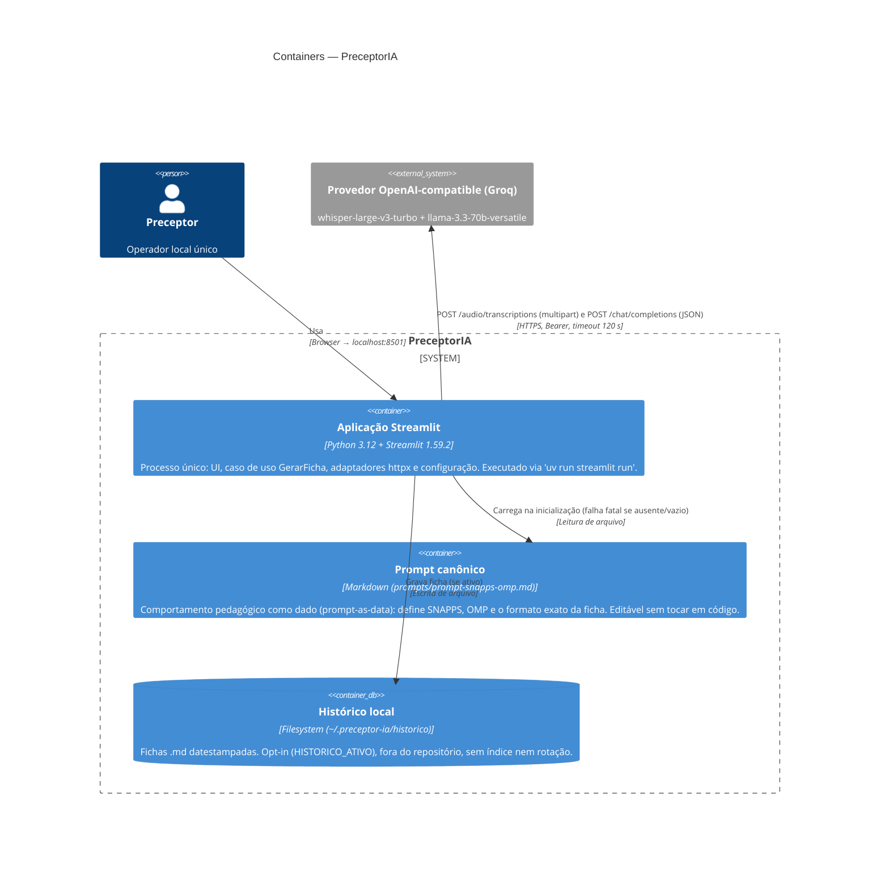

# C4 — Nível 2: Containers — PreceptorIA

> Gerado pelo **Architect** (Reversa) em 2026-07-20.
> Escala: 🟢 CONFIRMADO · 🟡 INFERIDO · 🔴 LACUNA

## Diagrama

## Inventário de containers

| Container | Tecnologia | Responsabilidade | Confiança |
|---|---|---|---|
| Aplicação Streamlit | Python ≥ 3.12, Streamlit 1.59.2, httpx 0.28.1, pydantic-settings 2.14.2 | Todo o código executável: UI, orquestração, adaptadores, config | 🟢 |
| Prompt canônico | Markdown | Fonte única do comportamento pedagógico (ADR-0003) | 🟢 |
| Histórico local | Filesystem | Persistência opcional de fichas (ADR-0005) | 🟢 |

## Observações arquiteturais

- **Monólito de processo único** 🟢 — não há banco de dados, fila, cache externo nem serviço auxiliar. A "arquitetura de containers" real é: 1 processo Python + 2 pontos de arquivo + 1 API externa.
- **O prompt é um container lógico, não físico** 🟡 — classificá-lo como container é decisão de modelagem: ele é um artefato de comportamento versionado separadamente do código (ADR-0003), com ciclo de mudança próprio, e alterá-lo muda o sistema sem redeploy de código.
- **Sem Dockerfile/docker-compose** 🟢 — deploy é `uv sync --frozen` + `streamlit run` na máquina do preceptor ([inventory.md](inventory.md)); não há artefato de infraestrutura para um diagrama de deployment.
- **Configuração atravessa a fronteira via `.env`** 🟢 — `LLM_API_KEY` obrigatória; base URL e modelos trocáveis sem código (ADR-0004).
