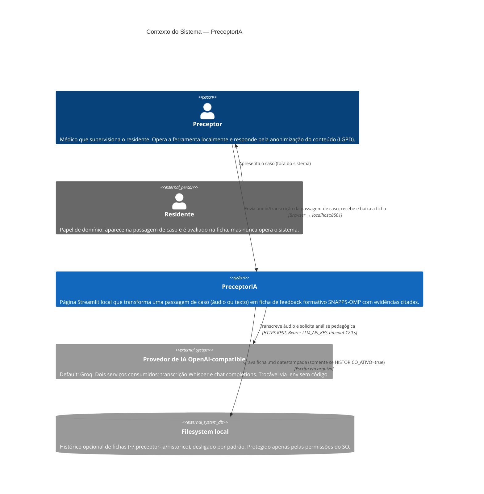

# C4 — Nível 1: Contexto — PreceptorIA

> Gerado pelo **Architect** (Reversa) em 2026-07-20.
> Escala: 🟢 CONFIRMADO · 🟡 INFERIDO · 🔴 LACUNA

## Diagrama

## Leitura do diagrama

- **Um único usuário humano** 🟢 — o preceptor, papel único sem autenticação ([permissions.md](permissions.md)). O residente é ator de domínio, não de sistema.
- **Uma única integração externa** 🟢 — o provedor OpenAI-compatible, consumido por dois endpoints REST (`/audio/transcriptions` e `/chat/completions`). Não há webhooks, filas nem eventos.
- **Fronteira de privacidade** 🟢 — o conteúdo clínico sai do perímetro local apenas na chamada ao provedor; o app não retém áudio (RN-P4) e o histórico é opt-in (RN-C3). O aviso LGPD na UI rege essa relação de confiança.
- **Modo demo/contingência** 🟢 — com o caso simulado embutido e a ficha de exemplo offline, o sistema opera de ponta a ponta sem tocar o provedor, o que faz da integração externa uma dependência *evitável* em demonstração.
