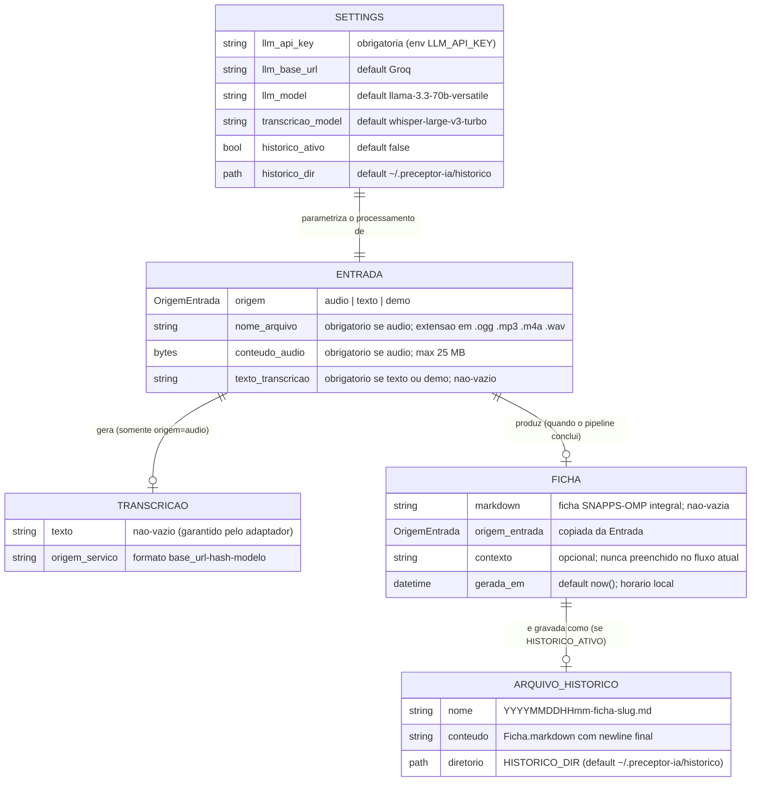

# ERD Completo — PreceptorIA

> Gerado pelo **Architect** (Reversa) em 2026-07-20.
> Escala: 🟢 CONFIRMADO · 🟡 INFERIDO · 🔴 LACUNA
>
> **Nota de escopo:** não há banco de dados ([inventory.md](inventory.md)). As "entidades" são dataclasses imutáveis em memória; a única persistência é o arquivo Markdown do histórico opcional. O ERD abaixo modela o relacionamento conceitual entre elas — cardinalidades refletem o fluxo do caso de uso, não constraints de banco.

## Diagrama

## Cardinalidades explicadas

| Relação | Cardinalidade | Justificativa | Confiança |
|---|---|---|---|
| Entrada → Transcricao | 1 : 0..1 | Só origem `AUDIO` passa pela transcrição; texto/demo pulam a etapa. Nenhuma transcrição existe sem a entrada que a originou. | 🟢 |
| Entrada → Ficha | 1 : 0..1 | Pipeline atômico: ou devolve exatamente uma ficha, ou levanta erro nomeado e nenhuma ficha existe. | 🟢 |
| Ficha → ArquivoHistorico | 1 : 0..1 | Gravação apenas com `HISTORICO_ATIVO=true`; colisão no mesmo minuto sobrescreve (na prática, um arquivo pode corresponder à *última* de várias fichas 🟡). | 🟢/🟡 |
| Settings → Entrada | 1 : N | Uma configuração (cacheada por processo via `st.cache_resource`) parametriza todas as entradas da sessão. | 🟢 |

## Identidade e chaves

- **Nenhuma entidade tem ID persistido** 🟢 — objetos imutáveis criados e descartados por execução; não há chave primária formal.
- **Chave natural do histórico**: o nome do arquivo (`{timestamp-minuto}-ficha-{slug}`) funciona como chave única *fraca* — unicidade garantida apenas entre minutos distintos (lacuna L3 de [domain.md](domain.md)). 🟡
- **Chave de deduplicação de sessão**: SHA-256 de (origem + texto + bytes do áudio), mantida em `st.session_state` — identidade transiente de UI, não de domínio. 🟢
