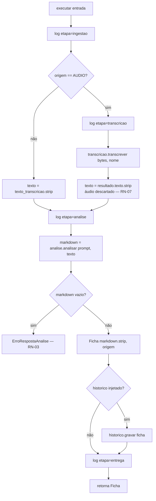
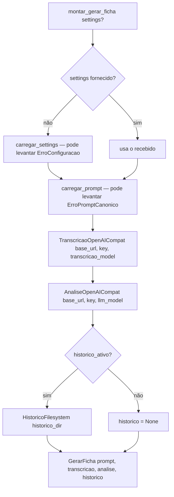

# Flowchart — módulo `application`

> Archaeologist (Reversa), 2026-07-20. 🟢 CONFIRMADO a partir de `application/gerar_ficha.py` e `factory.py`.

## Caso de uso `GerarFicha.executar`

## Composition root `montar_gerar_ficha`

