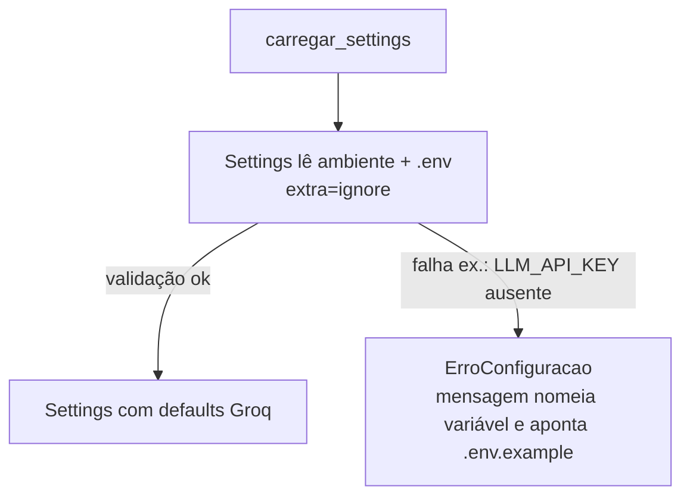

# Flowchart — módulo `config`

> Archaeologist (Reversa), 2026-07-20. 🟢 CONFIRMADO a partir de `config.py`.

Precedência: variáveis de ambiente > `.env` > defaults de código (comportamento padrão do pydantic-settings). Único campo obrigatório: `LLM_API_KEY`.
