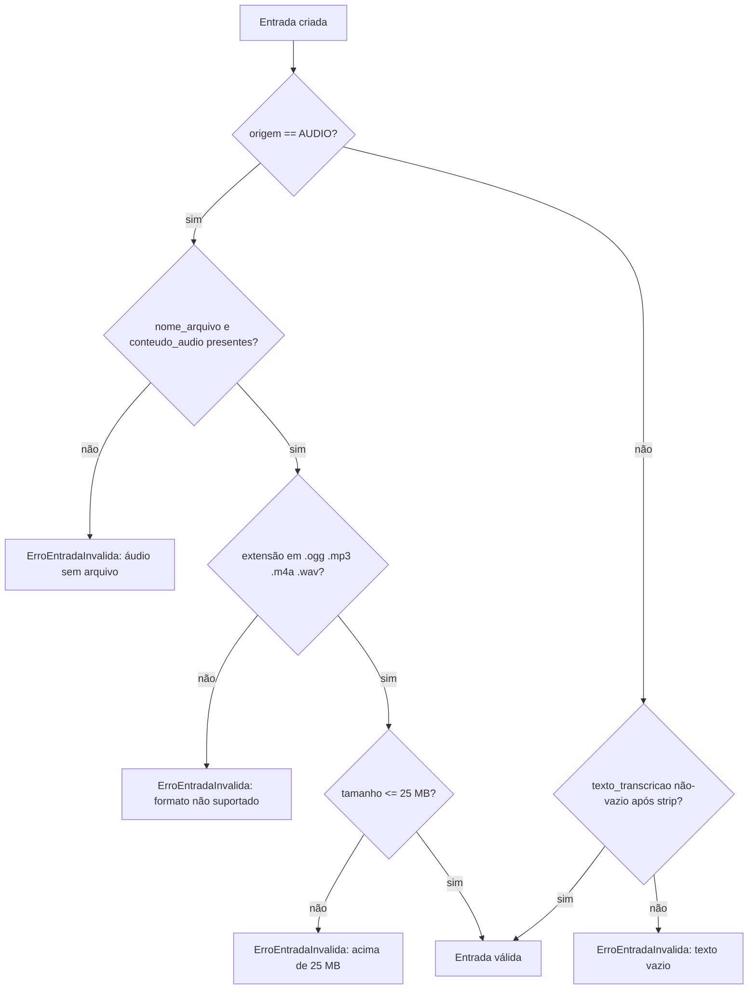
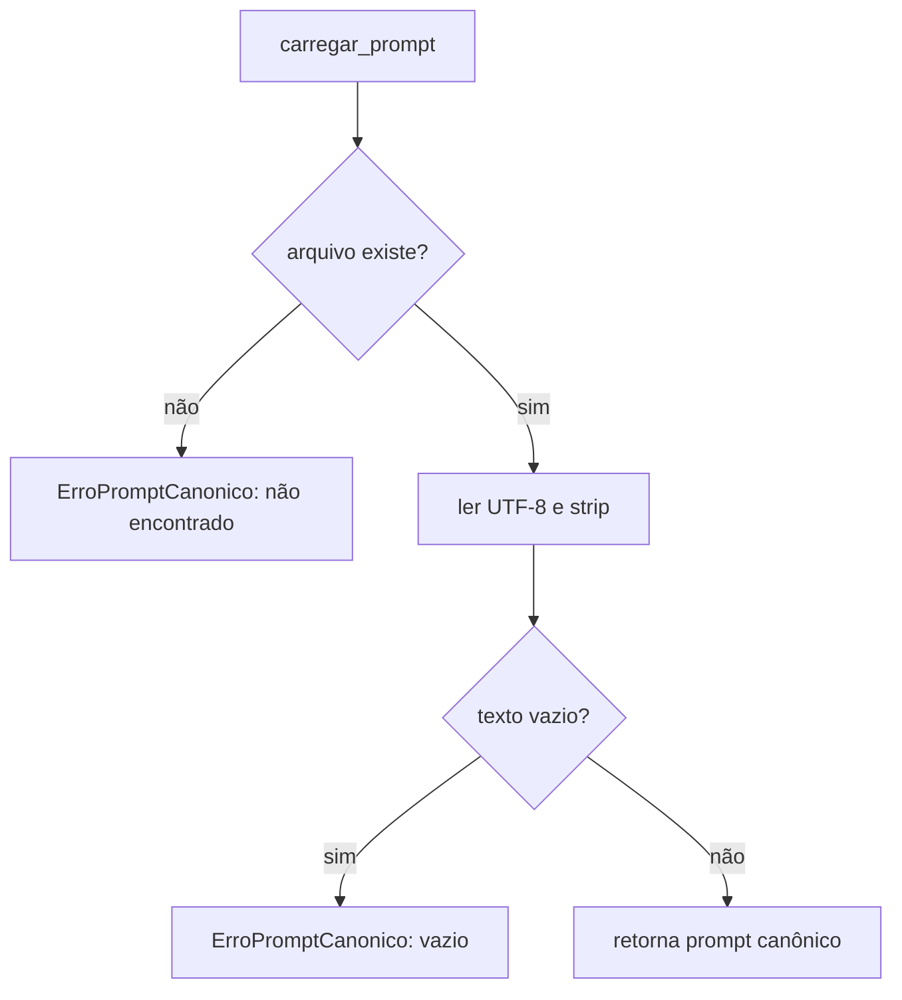

# Flowchart — módulo `domain`

> Archaeologist (Reversa), 2026-07-20. 🟢 CONFIRMADO a partir de `domain/models.py` e `domain/prompt.py`.

## Validação de `Entrada.__post_init__`

## `carregar_prompt(caminho)`

