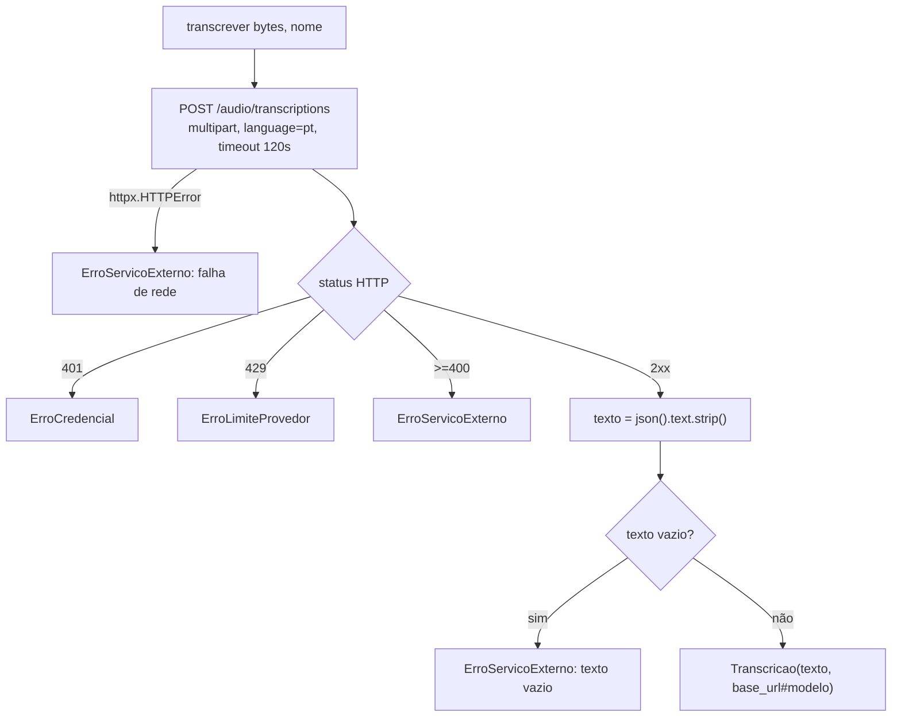
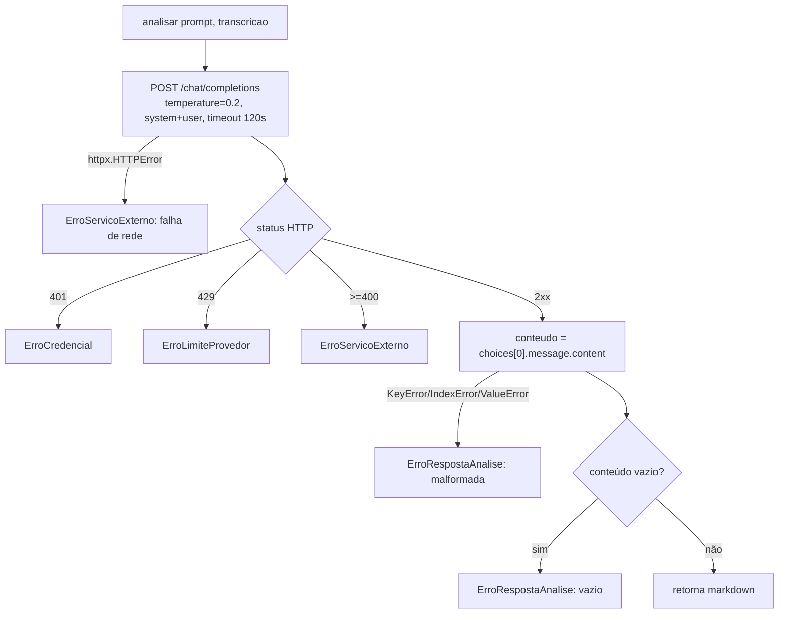
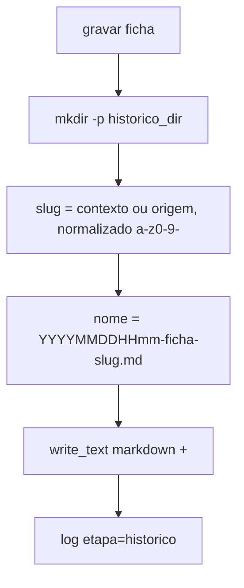

# Flowchart — módulo `infra`

> Archaeologist (Reversa), 2026-07-20. 🟢 CONFIRMADO a partir de `infra/transcricao_openai.py`, `analise_openai.py`, `historico.py`.

## `TranscricaoOpenAICompat.transcrever`

## `AnaliseOpenAICompat.analisar`

Ambos os adaptadores compartilham `_levantar_erro_nomeado` (mapa status → erro de domínio), definida em `transcricao_openai.py:49`.

## `HistoricoFilesystem.gravar`

