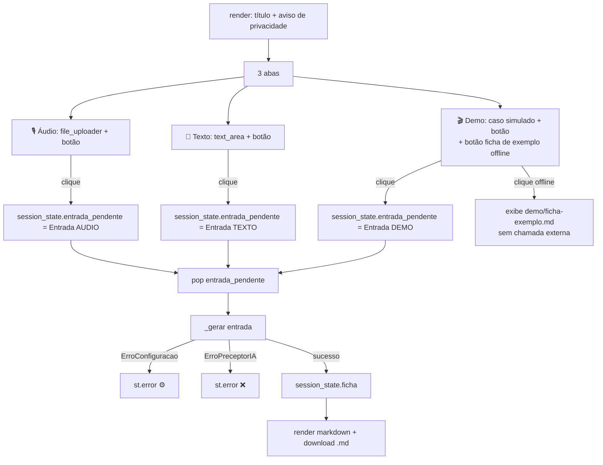
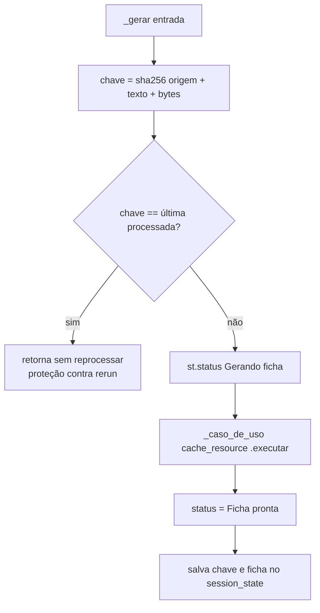

# Flowchart — módulo `ui`

> Archaeologist (Reversa), 2026-07-20. 🟢 CONFIRMADO a partir de `ui/app.py`.

## Ciclo de página Streamlit

## `_gerar` — deduplicação e progresso

Notas:
- `Entrada` inválida levanta `ErroEntradaInvalida` já na construção (dentro do handler das abas → capturado no bloco externo).
- `@st.cache_resource` congela fábrica e settings pelo tempo de vida do processo 🟡.
