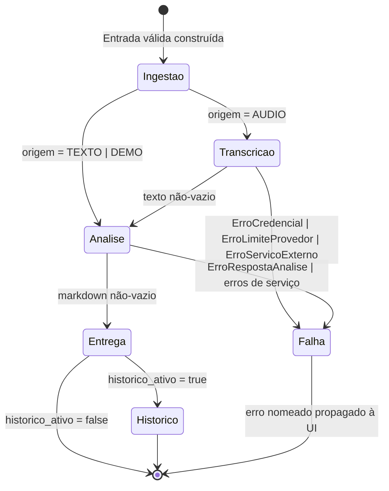
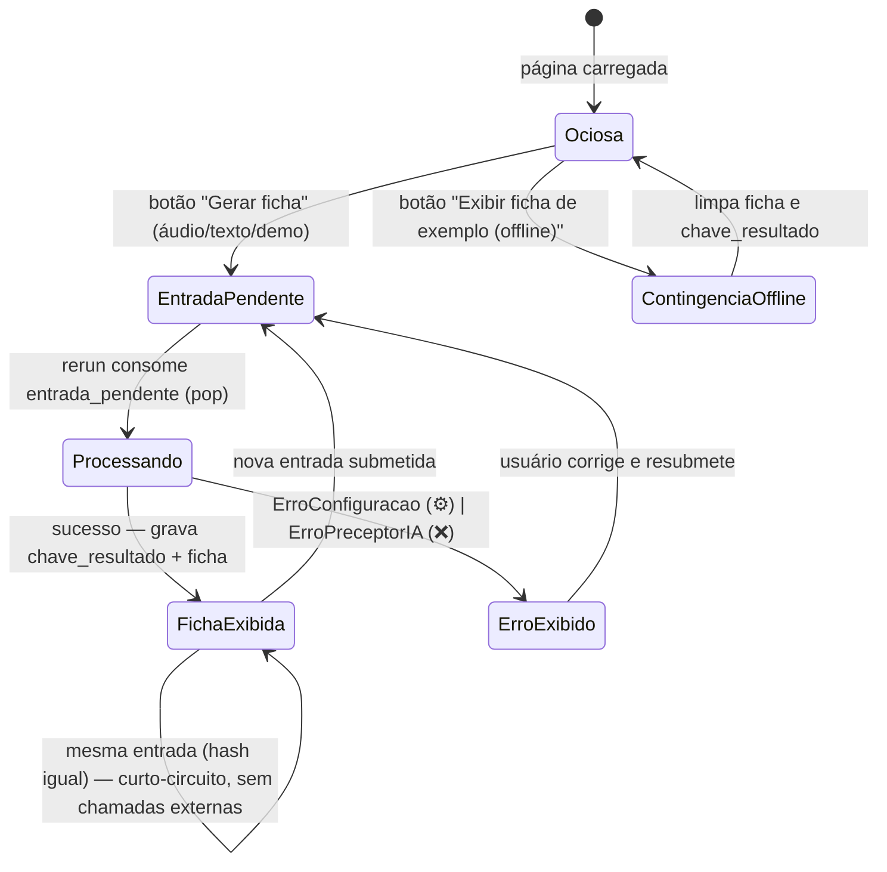

# Máquinas de Estado — PreceptorIA

> Gerado pelo **Detective** (Reversa) em 2026-07-20.
> Escala: 🟢 CONFIRMADO · 🟡 INFERIDO · 🔴 LACUNA

## Observação estrutural

Nenhuma entidade persistida possui campo de status: `Entrada`, `Transcricao` e `Ficha` são dataclasses **imutáveis** (`frozen=True`), criadas válidas ou nunca criadas (validação no `__post_init__`). 🟢 O que existe de "estado" no sistema são dois fluxos transientes: o pipeline do caso de uso e o ciclo de vida da sessão Streamlit.

## 1. Pipeline de geração de ficha (caso de uso `GerarFicha`)

Estados correspondem às etapas logadas (`etapa=...`). A transcrição só ocorre para origem `AUDIO`; texto e demo pulam direto para a análise. 🟢 (`application/gerar_ficha.py`)

| Transição | Gatilho | Guarda | Evidência |
|---|---|---|---|
| construção → Ingestão | `GerarFicha.executar(entrada)` | `Entrada` já validada no construtor | `gerar_ficha.py:29-30` 🟢 |
| Ingestão → Transcrição | origem é `AUDIO` | bytes e nome presentes (assert) | `gerar_ficha.py:47-56` 🟢 |
| Ingestão → Análise | origem é `TEXTO`/`DEMO` | texto não-vazio (garantido pelo modelo) | `gerar_ficha.py:48-49` 🟢 |
| Transcrição → Análise | HTTP 2xx com `text` não-vazio | — | `transcricao_openai.py:42-46` 🟢 |
| Análise → Entrega | conteúdo não-vazio | `markdown.strip()` truthy | `gerar_ficha.py:34-40` 🟢 |
| Entrega → Histórico | repositório injetado | `HISTORICO_ATIVO=true` na fábrica | `gerar_ficha.py:41-42`, `factory.py:19` 🟢 |
| qualquer → Falha | exceção nomeada | — | hierarquia em `models.py:11-32` 🟢 |

Não há retry nem estado intermediário persistido: cada execução é atômica do ponto de vista do usuário — ou devolve `Ficha`, ou levanta erro nomeado. 🟢

## 2. Ciclo de vida da sessão Streamlit

Estado mantido em `st.session_state` com três chaves: `entrada_pendente` (fila de 1 elemento), `chave_resultado` (hash SHA-256 de dedup) e `ficha` (resultado exibido). 🟢 (`ui/app.py`)

| Aspecto | Comportamento | Evidência |
|---|---|---|
| Fila de 1 elemento | `entrada_pendente` é gravada pelo botão e consumida com `pop` no fim do script; nova submissão substitui a anterior. | `ui/app.py:70-72,95-96` 🟢 |
| Deduplicação | Hash de (origem + texto + bytes); hash igual ao último processado → retorno imediato. | `ui/app.py:43-48` 🟢 |
| Contingência offline | Zera `ficha` e `chave_resultado` e renderiza o exemplo direto, fora do fluxo normal. | `ui/app.py:89-93` 🟢 |
| Caso de uso cacheado | `st.cache_resource` monta `GerarFicha` uma vez por processo (adaptadores e prompt reutilizados entre sessões). | `ui/app.py:37-39` 🟢 |
| 🟡 | A ficha exibida some se o usuário exibir a contingência offline (estado limpo); único caminho que "desfaz" um resultado. | `ui/app.py:90-91` 🟡 |

## 3. Enum `OrigemEntrada` (não é máquina de estado)

`AUDIO`, `TEXTO` e `DEMO` são origens mutuamente exclusivas fixadas na construção da `Entrada` — não há transição entre elas. Registrado aqui apenas para evitar interpretação equivocada do enum como status. 🟢 (`domain/models.py:35-38`)
